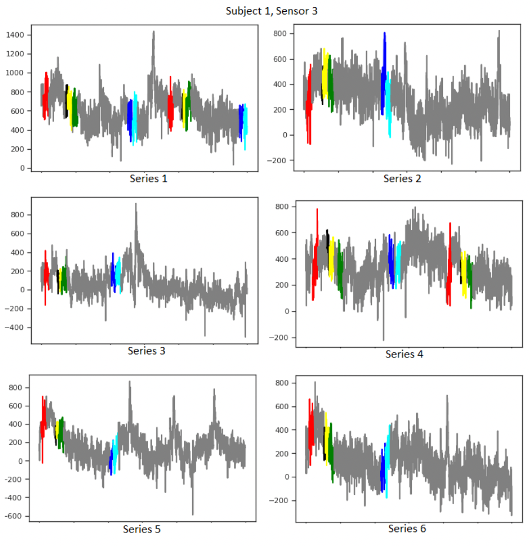
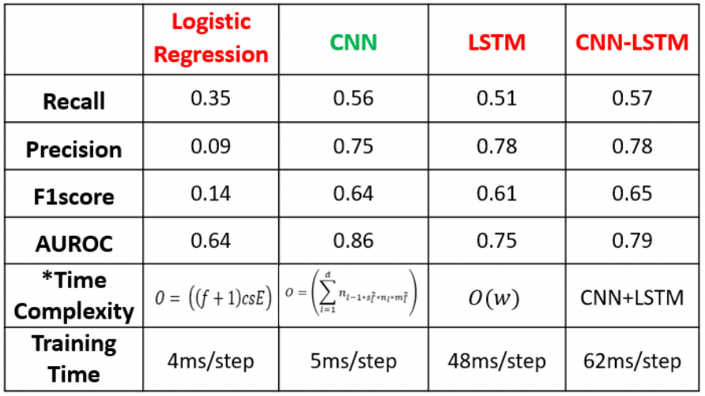

# Grasp-and-Lift-EEG-detection
## Abstract
Multitude of people have lost their limbs due to some amputation or neurological disabilities. The Brain-Computer Interfaces (BCI’s) require the processing of Electroencephalogra- phy (EEG) signals which are quite complex in nature. Although various signal processing techniques and Machine Learning(ML) models have been proposed earlier, no method can be considered as superior to its other counterparts for detecting the intention of hand movement. The objective of the project is to detect 6 types of hand movements from labeled dataset procured from Kaggle, Grasp-and-Lift EEG Detection. Some variants of pre-processing techniques along with exploratory analysis have been implemented and the detection capabilities of several Machine Learning models are investigated and discussed.

## Dataset Exploration
The Grasp-and-Lift EEG Detection dataset contains multi- channel EEG recordings from 12 different participants (sub- jects) during 3936 grasps and lifts trials. Each participant underwent 8 different series of trials recorded at sampling frequency of 500Hz with varying object’s weight and friction values. In each trial, they were asked to perform the following 6 different actions in succession.

1) Hand Start: Starting to reach for an object.
2) First Digital Touch: Moment of contact between the finger and the object.
3) Both Digit Touch: Appearance of the lifting force.
4) Lift Off: Object leaving the support surface.
5) Replace: Object being replaced on the platform.
6) Both Released: Release of an object with all fingers.

The main objective of this problem is to classify the above intention of the subject by decoding signals within some timeframe. Each timeframe in the dataset has been labeled as a combination of subject, series and the frame to which it belongs.

Each observation (row) includes the data gathered through 32 electrodes positioned over the head of each participant at every timestamp in the signal. The 32 channels will serve the purpose of features while implementing Machine Learning models on the data. The occurrence of any action is labelled if it happens between 150ms at the current timestamp. The final output will contain 6 columns containing either 0 or 1 corresponding to the occurrence of an event happening within the selected window stride i.e. 150ms (75 frames).

  

For each subject 6 series of trials will be considered as training data and 2 series of trials will be testing data. It can be inferred from the below sensor 3 signal plot of the subject 1, there is a lot of variation between the signals even for the same sensor and subject in consideration. Various colors in the figure below represent different actions observed during the trials, while gray specifies no action being active.

## Data Preprocessing
Raw EEG signals are generally required to be pre-processed before passing it to different models. Following prep-processing techniques has been considered for EEG signals. The dataset contain millions of record; however, we decided to evaluate model on subject 1 which has nearly million observations.
A. Time Domain Filtering
Raw EEG data needs to be processed because the data has been recorded at a high sampling frequency (500Hz); however, the rate of change of detected action is low ( 12Hz). Intuitively, a low pass filter can be applied to raw input because it attenuates the data with a frequency higher than a certain threshold and allows the input signal with lower frequency. Low pass filter has been applied by the following 2 ways:
1) Simple Low Pass Filter: The simple low pass filter is applied by subsampling the data i.e. reducing the number of samples to be considered for training.
2) Butterworth Filter: The Butterworth filter is a popular choice among low pass filters because it has minimal ripples in the frequency response i.e. passband is almost flat rather than abrupt step in normal low pass filter.

B. Dimensionality Reduction
The considered data is acquired from the 32 different sen- sors; hence, data has high dimensionality and it is imperative to check if some of the features are correlated or if there are any redundant dimensions. There are numerous ways to reduce the dimension, but here we are considering one of the common ways, which is Principal Component Analysis (PCA).

C. Standardization
Standardization is crucial to bring the different features to the same scale and it makes sure that one feature doesn’t overpower the other feature while training. 

## Results and Discussion
The detection capability of a model can be determined using recall, precision, and AUC ROC. The recall tells about the detection rate of i.e. the percentage of the correctly detected events whereas precision is how precise is the detection is. There is always a tradeoff between recall and precision. The low average precision and recall values of logistic regression clearly specify that this model was unsuccessful in detect- ing most of the events. The f1-scores balances the tradeoff between recall and precision. The high f1-score of the CNN- LSTM ensemble model signifies, it is the model with the best detection capabilities; however, its results are not significantly better than CNN. Therefore, it is imperative to consider the other parameters viz. time complexity and training time before giving the final verdict about the best model.

  

It can be seen in above figure that the time complexity of the CNN-LSTM ensemble model is of higher-order as compared to the CNN model because it is the summation of the time complexity of CNN and LSTM model. Also, the training time of the ensemble model is nearly 12 times the training time of CNN. The improvement in the results by using the ensemble model is not significant as compared to cost in the training the model so, it can be concluded that CNN is the best model to detect 6 events from the EEG signals dataset.

